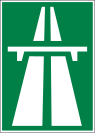
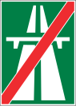
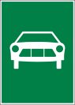
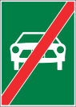

# Автобан

Начало

Конец

Максимальная скорость 120км/ч.

В случае отмены знака ограничения скорости возвращается в 120.
На автобане бывают ограничения в 100, 80, 70, 60 км/ч.
Отмены бывает либо предыдущего знака, либо просто крест всего.

# Автомагистраль

Начало

Конец

На автомагистрали ограничение скорости 100 км/ч.

## Порядок езды на автобане

Элемент выполняется в следующем порядке

### Заезда

Автомобиль въезжает на полосу разгона, смотрит знаки. 

### Набора соответствующей скорости, перестроение в автобан и соблюдение дистанции

Разгоняется, когда начинается автомагистраль со скоростью потока, смотри как обычно при повороте в зеркало, в боковое зеркало и в окно. Разгоняться необходимо в полосе разгона, а не на автобане. Включает поворотник и ждет пока его пропустят или проедут другие машины.

На автобане нужно ехать 110-120, выбирать скорость в соответсвии с дорожной остановкой и погодными условиями. Соблюдать дистанцию необходимую в случае чего для остановки.

### Съезд

Снижать скорость необходимо в полосе торможения, а не на автобане. Съезжаем и потихоньку неторопясь снижаем скорость.
 
