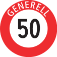

# Езда внутри населенного пункта

Ограничение 50 км/ч. Начинается, когда стоит знак ограничения 50 Generell.

Заканчивается, когда видим знак ограничения 60 или конец 50 Generale.

На велосипедные штрихпунктирные дорожки можно наезжать. Тоже самое с пустыми парковочными местами. Желтым цветом разметка для автобусов. Перед поворотом, если разметка желтая сплошная - на эту полосу заезжать нельзя.

Прежде чем делать любой поворот, вправо или влево необходимо заранее метров за 40 посмотреть в зеркало заднего вида, в правое(в левое, если налево) зеркало, в правое (в левое, если налево) окно. Потом включить поворотник и делать все как обычно. Для отработки данной привычки можно повторять себе под нос 1, 2, 3 и показательно вертеть головой в сказанных направлениях.

## Проезд кольца

Кольца в Швейцарии главные. Перед заездом поворотник не показываем (ни влево, ни вправо). Перед съездом после проезда предыдущего съезда посредине дороги, смотрим направо в зеркало и в окно на наличие велосипедистов и включаем поворотник направо. Съезжаем.
