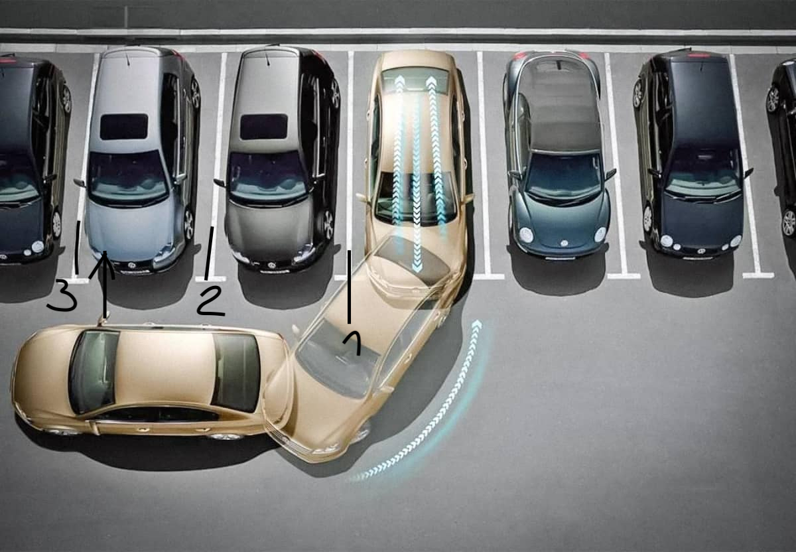
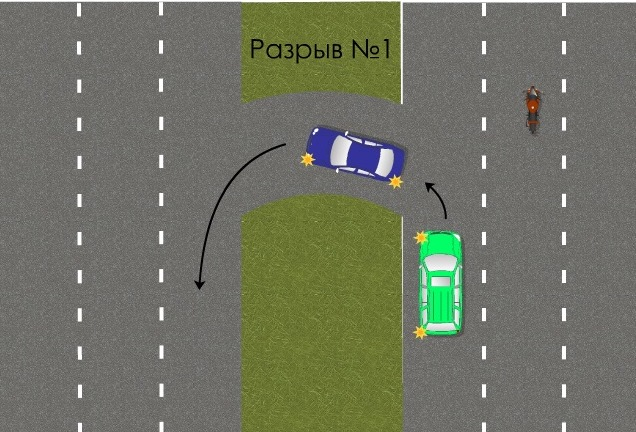

# Маневры
## Остановка и выезд

Для остановки делаем все то же, что и для поворота направо, смотрим 1, 2, 3 в зеркало заднего вида в правое зеркало, в правое окно. Включаем правый поворотник и встаем вдоль бордюра аккуратно.

## Парковка вперед

Обычно не нужна никогда.

> [!Video https://www.youtube.com/embed/WSUIMXNmA3M]

## Парковка назад

Поворотник вправо. Ищем место для парковки. Лучше там где нет препятствий.
Справа должно быть 1.5 - 2 метра не меньше, где останавливаться зависит от габаритов авто. Примерно Третья линия д.б. левее на 20см стойки пассажира. Выворачиваем руль до упора и едем назад. После того как встали на место, едем вперед метров 5 и без верчения руля встаем ровно иначе машина будет стоять криво. 

## Параллельная парковка

Также выбираем место где никто не подпирает сзади.
Где должен быть зад зависит от габаритов. Важно встать очень близко (30 см) от существующей машины. Зад чужой машины примерно правее 20 см. от стойки пассажира (т.е. виден в окно сзади на 20 см. правее стойки). Выворачиваем руль до упора вправо. Едем пока левое заднее колесо не доедет до линии. (красненькая полоска левой стороны машины на экране приближается, но не заходит на белую линии парковки). Останавливаемся, выкручиваем руль влево до упора. Опускаем правое зеркало, чтобы было видно правое заднее колесо низ. (если это возможно) Едем потихоньку не касаясь тротуара. Если не получается, останавливаемся, выкручиваем руль наоборот и сдаем чуть-чуть вперед. Потом руль снова влево, пока машина не встанет параллельно тротуару. Ставим руль прямо и в зависимости от разметки сдаем назад или вперед до совпадения с линией зада или переда. 
> [!Video https://www.youtube.com/embed/SErKjqmpL-o]

## Развороты Wenden
Главное требование в Швейцарии: уважительно относиться к другим. Не забываем, что если мы в тупике, то там в конце как правило есть место для полного разворота.
Повороты следует совершать только следующим образом, никакие другие способы не считаются верными:

### Разворот задом

> [!WARNING] 
> Выполняется на парковке задом (Wenden rückwärts)

* Задом через правую полосу (Wenden rückwärts in Ausweichstelle rechts)

Не забываем про поворотник вправо.

* Задом через левую полосу Wenden rückwärts in Ausweichstelle links

* Трехточечный разворот 3 Punkt Wenden

### Разворот передом (U-Turn)

> [!WARNING]
> Выполняется на кольцах и вокруг "островков" 

Для U-Turn требуется много места. Делать u-turn нужно через островки или где есть круговое движение.

* Разворот через разделительную полосу (insel turn)

* Разворот через кольцо

## Задний ход

> [!WARNING]
> Задом запрещено ехать в туннеле, на кольцах, автобанах, магистралях, дорогах с односторонним движением 

В Швейцарии на экзамене могут попросить проехать задом. Для этого необходимо занять полосу встречного движения и ехать не по своей полосе, а задом по встречке. 
Для этого повернуть налево и занять крайне левое положение встречного движения не менее 5 метров от перекрестка в соответсвии со всеми особенностями поворота налево, зеркалами и взглядами в окно. Потом начинаем ехать задом и пропускаем транспорт (при приближении транспорты мы должны остановиться и наш левый поворотник мигает) который подъезжает к нам спереди. Встречка к нам будет спереди подъезжать. Таким образом может получиться, что вы будете задом ехать на перекрестке. Едем задом налево и после 5 метров от перекрестка останавливаемся. Поворотник влево так и должен моргать. Потом убеждаемся, что можно ехать вперед, показываем поворотник вправо и поехали вперед.

## Экстренное торможение

Экзаменатор попросит разогнаться и потом стукнет по панели или скажет Vollbremsung - тормозим в пол. Никуда смотреть по зеркалам не нужно (лучше заранее смотреть до), на то оно и экстренное торможение. Инструктор сказал нужно ехать 40 км/ч, т.к. иначе ему будет некомфортно. Должна ABS жестко прохрустеть. На данный маневр дается 2 попытки. Не сделал второй раз - несдача.

## Безопасная остановка в горной местности (Bergestrasse sichern кажется)

Эксперт увидит уклон процентов 10+ и попросит остановиться справа. Ищем место, где бордюр имеет явные четкие квадратные границы. Включаем поворотник вправо, встаем до упора к бордюру. Выкручиваем руль влево. Включаем нейтралку и с тормозом сползаем вниз, пока машина не упрется в бордюр и не остановится. Включаем P. Ставим ручник. Выключаем машину. Выходим, достаем из багажника упорку для колеса, вставляем под правое заднее колесо. Все.
