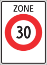
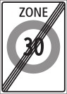
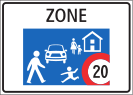
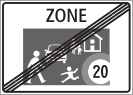

## Zone 30
Начало

Конец

Люди переходить дорогу могут, когда нет машин. Пропускать специально водители не должны. Авто имеет преимущество.

В Зоне 30 много равнозначных перекрестков без знаков приоритета. Иногда имеется разметка полос, но не всегда. Действует помеха справа. При подъезде к такому перекрестку необходимо сбросить скорость и смотреть в зеркала и в окно, что справа никого нет.

## Zone 20

Начало

Конец

Люди могут ходить, как угодно и имеют преимущество перед авто.

Знак распростаняется не только на улицу, где он стоит, но и на все ответвления.