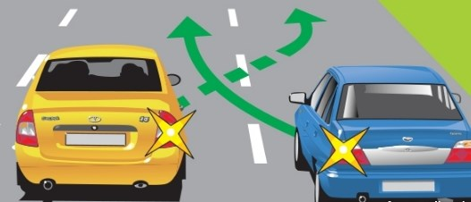
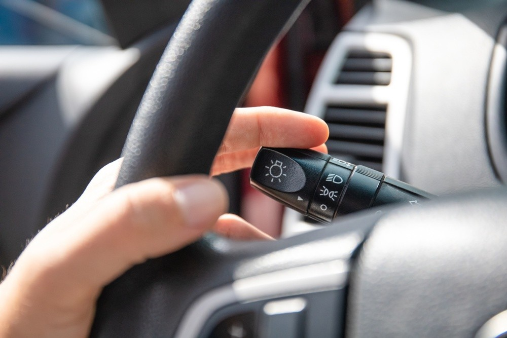
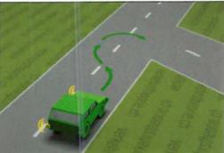

## 3.1 ВКЛЮЧЕНИЕ СВЕТОВЫХ УКАЗАТЕЛЕЙ ПОВОРОТА, КОТОРЫЕ НЕОБХОДИМО ПОДАВАТЬ ПРИ ИЗМЕНЕНИИ НАПРАВЛЕНИЯ

### Правило 3.1.01

Водитель должен сигнализировать о любом изменении направления движения, включая поворот направо.

> [!TIP]
> (любой съезд с основной улицы даже когда направление по факту не меняется, но считается это движение как бы изменение направления по отношению главной улице. комментарии автора перевода)

### Правило 3.1.02

Прежде чем изменить направление движения,
водитель должен заблаговременно просигнализировать о своём намерении посредством
указателей поворота или соответствующих сигналов, подаваемых рукой.
Это правило относится в частности к следующим ситуациям:

1. перестроение автомобиля перед поворотом.
2. обгон или разворот .
3. встраивания в поток автомобилей или остановка на обочине дороги.
4. съезд с перекрёстка с круговым движением.

Водитель не обязан сигнализировать о своем направлении движения при въезде
на перекрёсток с круговым движением и
при движении по перекрёстку с круговым движением,
если он не собирается не меняет направление движения.
Водитель, подающий сигнал о своих намерениях другим участникам дорожного движения,
тем не менее не освобождается от обязанности соблюдать необходимые меры предосторожности.

### Правило 3.1.03

Если перед тем, как совершить поворот,
водитель должен сначала переместиться к противоположному краю проезжей части
либо из-за размеров транспортного средства,
либо из-за конфигурации конкретного участка дороги,
он должен просигнализировать о своём манёвре
(сначала указателем левого поворота, а затем - указателем правого поворота),
принять особые меры предосторожности и при необходимости остановиться.
В случае сомнения лучше продолжить движение, чтобы развернуться позднее.