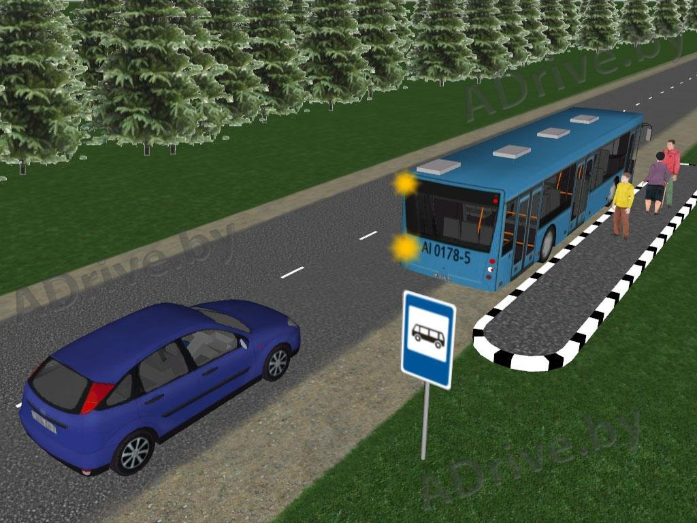

## 3.1 ВКЛЮЧЕНИЕ СВЕТОВЫХ УКАЗАТЕЛЕЙ ПОВОРОТА, КОТОРЫЕ НЕОБХОДИМО ПОДАВАТЬ ПРИ ИЗМЕНЕНИИ НАПРАВЛЕНИЯ

### Правило 3.1.01

Водитель должен сигнализировать о любом изменении направления движения, включая поворот направо.

> [!TIP]
> (любой съезд с основной улицы даже когда направление по факту не меняется, но считается это движение как бы изменение направления по отношению главной улице. комментарии автора перевода)

### Правило 3.1.02

Прежде чем изменить направление движения,
водитель должен заблаговременно просигнализировать о своём намерении посредством
указателей поворота или соответствующих сигналов, подаваемых рукой.
Это правило относится в частности к следующим ситуациям:

1. перестроение автомобиля перед поворотом.
2. обгон или разворот .
3. встраивания в поток автомобилей или остановка на обочине дороги.
4. съезд с перекрёстка с круговым движением.

Водитель не обязан сигнализировать о своем направлении движения при въезде
на перекрёсток с круговым движением и
при движении по перекрёстку с круговым движением,
если он не собирается не меняет направление движения.
Водитель, подающий сигнал о своих намерениях другим участникам дорожного движения,
тем не менее не освобождается от обязанности соблюдать необходимые меры предосторожности.

### Правило 3.1.03

Если перед тем, как совершить поворот,
водитель должен сначала переместиться к противоположному краю проезжей части
либо из-за размеров транспортного средства,
либо из-за конфигурации конкретного участка дороги,
он должен просигнализировать о своём манёвре
(сначала указателем левого поворота, а затем - указателем правого поворота),
принять особые меры предосторожности и при необходимости остановиться.
В случае сомнения лучше продолжить движение, чтобы развернуться позднее.

## 3.2 ТРОГАНИЕ С МЕСТА, ЗАДНИЙ ХОД, РАЗВОРОТ

### Правило 3.2.01

Прежде чем тронуться с места, водитель должен убедиться в том,
что он не подвергает опасности никакого ребенка или другого участника дорожного движения.
Если транспортное средство скрывает вид сзади,
водитель должен начинать движение назад только с помощью третьего лица,
за исключением тех случаев, когда любая опасность исключена.
Автомобиль, двигающийся задним ходом, не имеет преимущества.

### Правило 3.2.02

Когда внутри населенного пункта водитель рейсового автобуса,
стоящего на остановке общественного транспорта,
обозначенной как таковая, включает указатель поворота для того,
чтобы просигнализировать о том, что он собирается отъехать от остановки,
водители следующих сзади транспортных средств должны при необходимости снизить скорость или остановиться,
чтобы позволить ему отъехать; это правило не применяется, когда остановка располагается с левой стороны проезжей части.
Водитель автобуса должен включить указатели поворота только перед тем, как отъехать от остановки.
При этом он обязан подождать, если следующие сзади транспортные средства не успевают вовремя остановиться.

### Правило 3.2.03

Задний ход должен осуществиться только на малой скорости.
Запрещается пересекать задним ходом перекрестки без должной видимости и железнодорожные переезды,
а также двигаться задним ходом по автомагистралям и дорогам для автомобилей.

### Правило 3.2.04

На участках ограниченной длины задний ход допускается только в том случае,
если невозможно продолжать двигаться вперёд или сделать разворот .

### Правило 3.2.05

Знак «Разворот запрещён» запрещает транспортным средствам разворот на дороге в указанном месте.
Поворот налево разрешён.