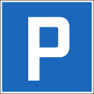
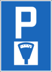
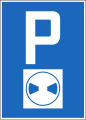
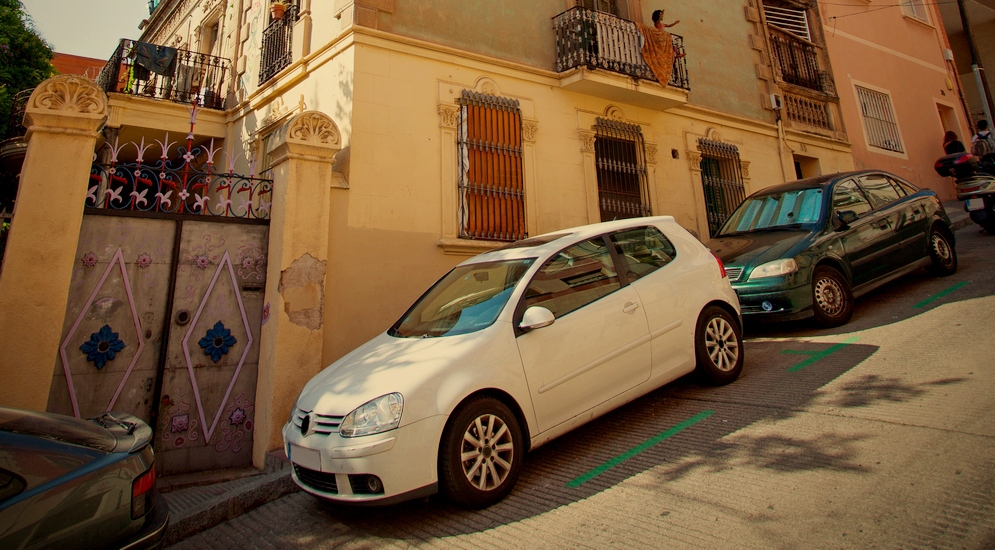
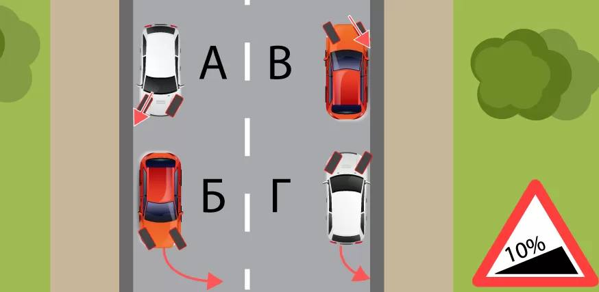

# 2 Остановка транспортных средств
## 2.1 Остановка

### Правило 2.1.01
Водитель, желающий остановиться, должен по возможности принимать во внимание
следующие за ним транспортные средства.

### Правило 2.1.02

Транспортные средства не должны останавливаться и парковаться в местах,
где они могут затруднить или подвергнуть опасности дорожное движение.
По возможности они должны парковаться в специально отведённых для этого местах.

### Правило 2.1.03

Водители должны останавливаться по возможности вне проезжей части.
На проезжей части они должны останавливаться только с краю проезжей части
и параллельно направлению движения.
Остановка с левого края проезжей части разрешается только в следующих случаях:
1. если справа расположены трамвайные пути или пути легко-рельсового транспорта
2. при наличии знака, запрещающего остановку или парковку справа
3. на узких дорогах с низкой интенсивностью движения
4. на дорогах с односторонним движением

### Правило 2.1.05

При остановке движения водитель не должен останавливаться на пешеходном переходе
или на перекрестке,
преграждая путь транспортным средствам, двигающимся в поперечном направлении.

### Правило 2.1.06

Преднамеренная остановка запрещена:
1. В плохо просматриваемых местах, в частности, на повороте или на вершине холма после подъёма, а вблизи таких мест.
2. На сужениях дороги и рядом с препятствиями, расположенными на проезжей части;
3. На участках дороги, служащих для перестроения, а также рядом с разделительными линиями, сплошными линиями и двойными сплошными линиями, если ширины оставшегося проезда составляет менее 3 м;
4. На перекрестках, а также до и после перекрестка на расстоянии менее 5м до поперечной дороги;
5. На пешеходных переходах и на их продолжении на прилегающем участке, а также, при отсутствии знака запрета остановки – на расстоянии менее 5 м до перехода на проезжей части и на прилегающем тротуаре
6. На железнодорожных переездах и в тоннелях под железнодорожными путями
7. Перед дорожным знаком, который транспортное средство может скрыть от участников дорожного движения.

### Правило 2.1.07

Перед пешеходным переходом, параллельно правому краю проезжей части,
на расстоянии от 50 до 100 см от края,
наносится сплошная жёлтая линия длиной не менее 10 м,
запрещающая остановку.
Она запрещает преднамеренную остановку транспортного средства на проезжей части
и на примыкающем тротуаре. На дорогах с односторонним движением линия,
запрещающая остановку, наносится с правого и левого края проезжей части.

### Правило 2.1.08

На расстоянии не менее 10 м от указателя остановки общественного транспорта,
а также перед сооружениями и помещениями противопожарной службы лея.
остановка разрешается только для того,
чтобы позволить пассажирам выйти из общественного транспорта или зайти в него.
Создавать какие-либо препятствия для общественного транспорта и машин противопожарной службы запрещается.

### Правило 2.1.10

Рядом с транспортным средством, припаркованным вдоль края проезжей части,
остановка транспортного средства для погрузки или выгрузки товара разрешается
только если при этом не создаются препятствия движению.
По просьбе водителя припаркованного транспортного средства водитель
остановившегося для погрузки/выгрузки транспортного средства должен
незамедлительно обеспечить первому возможность покинуть стоянку.

### Правило 2.1.11

Если погрузка товара на транспортное средство или его выгрузка с него
должны производиться в месте, где это может создать препятствия для движения,
например, на извилистой горной дороге,
необходимо установить знаки аварийной остановки
или попросить других лиц предупреждать участников дорожного движения.

### Правило 2.1.12

Лица, садящиеся в транспортное средство, или выходящие из него,
не должны подвергать опасности других участников дорожного движения;
перед открытием двери следует обратить особое внимание на транспорт, идущий сзади.

## 2.22.2. ПАРКОВКА в Швейцарии

### Правило 2.2.01

Парковка транспортного средства - место, которое служит не только для посадки
или высадки пассажиров или погрузки или разгрузки товара.

### Правило 2.2.02

Транспортные средства должны парковаться таким образом,
чтобы занимать как можно меньше места.
Тем не менее, они должны размещаться таким образом,
чтобы не препятствовать отъезду других транспортных средств.

### Правило 2.2.03

Знак «Парковка разрешена» обозначает места, где разрешено парковать автомобиль.
План парковки, а также ограничения в отношении длительности
и права использования парковки могут быть указаны на дополнительном указателе.

### Правило 2.2.04

Знак «Платная парковка» обозначает места,
где автомобили могут парковаться только с оплатой стоимости парковки и на условиях,
указанных на паркомате.

### Правило 2.2.05

На узких дорогах парковка транспортных средств с обеих сторон разрешена только
в том случае, если это не препятствует движению других транспортных средств.

### Правило 2.2.06

Транспортные средства без номерных знаков установленного образца,
не имеют права парковаться на общественных местах для стоянки автотранспорта
или дорогах общего пользования;
исключение составляют места для стоянки автотранспорта,
доступные для широкой общественности, принадлежащие частным лицам,
если эти лица разрешили парковку таких транспортных средств.
В особых случаях исключение также может быть предоставлено компетентным органом.

### Правило 2.2.07

Парковочные места должны использоваться только транспортными средствами категорий,
на которые они были рассчитаны.
Парковочные места, помеченные знаком «Инвалиды»,
предназначены строго для лиц с ограниченным физическими способностями
или сопровождающих их лиц.

### Правило 2.2.08

Регулировка парковочного диска (паркомата) на всех парковках,
обозначенных знаком «Парковка с парковочным диском».
Стрелка должна быть установлена на черту, следующую за чертой часа фактического прибытия.
Разрешенная длительность парковки, указанная в синей зоне: в рабочие дни (а также по воскресеньям и выходным дням, если это явно указано) транспортные средства могут парковаться только следующим образом:

| Время прибытия А | Указываемое время | Время отбытия |
| ---------------- | ----------------- | ------------- |
| 08:00 - 08:29    |       08:30       |     09:30     |
| 08:30 - 08:59    |       09:00       |     10:00     |
|     и т.д.       |                   |               |
| 11:00 - 11:29    |       11:30       |     12:30     |
| 11:30 - 13:29    | след. за чертой А |     14:30     |
| 13:30 - 13:59    |       14:00       |     15:00     |
|     и т.д.       |                   |               |
| 17:30 - 17:59    |       18:00       |     19:00     |
| 18:00 - 07:59    | след. за чертой А |     09:00     |

С 19.00 до 07.59 нет необходимости устанавливать диск отметки времени парковки при условии, что транспортное средство покинет парковку до 08 00

### Правило 2.2.09

Парковка транспортных средств (за исключением велосипедов) на тротуаре запрещена,
если только это явно не разрешено знаками или разметкой.
При отсутствии таких знаков или разметки транспортные средства
могут останавливаться на тротуаре только для погрузки или выгрузки товара
или для посадки или высадки пассажиров.
При этом для пешеходов должен всегда оставаться проход шириной не менее 1,50 м
и операции должны производиться без промедления.

### Правило 2.2.10

Парковка запрещена:
1. во всех местах, где остановка запрещена;
2. на главных дорогах за пределами населенных пунктов,
3. на главных дорогах внутри населенных пунктов, если в результате оказывается недостаточно места для того, чтобы разъехаться двум автомобилям.
4. на велосипедных дорожках и на проезжей части, смежной с такими велосипедными дорожками:
5. на расстоянии менее 50 м до железнодорожного переезда вне населенных пунктов и менее 20 м внутри населенных пунктов.
6. на мостах;
7. перед входом в здания или на земельные участки других лиц.

### Правило 2.2.11

Знак «Стоянка запрещена» запрещает парковать транспортные средства на указанной стороне проезжей части.
Остановка транспортных средств для посадки или высадки пассажиров лиц или погрузки/выгрузки товаров разрешена.

## 2.3 ОБЕСПЕЧЕНИЕ БЕЗОПАСНОСТИ ТРАНСПОРТНОГО СРЕДСТВА

### Правило 2.3.01

Водитель, на время покидающий своё транспортное средство, должен остановить двигатель.
Перед тем, как покинуть транспортное средство,
он должен принять меры для предупреждения его самопроизвольного трогания с места
или несанкционированного использования.

### Правило 2.3.02

При парковке на наклонном участке дороги водитель должен поставить автомобиль
на стояночный тормоз и принять вторую меру безопасности для его фиксации на месте,
например, установив нижнее передаточное отношение коробки скоростей
или направив колеса на препятствие, расположенное на краю проезжей части.

### Правило 2.3.03

При парковке на крутом склоне неподвижность транспортного средства кроме того
должна быть обеспечена посредством тормозных колодок или иного предмета,
который может их заменить.
Тормозные колодки устанавливаются под колеса тяжелых автомобилей,
тягачей с несколькими прицепами и отцепленных прицепов при их парковке даже пологих склонах.
Прежде чем снова отправиться в путь,
водитель должен освободить проезжую часть от предметов, использованных им в качестве тормозных колодок.